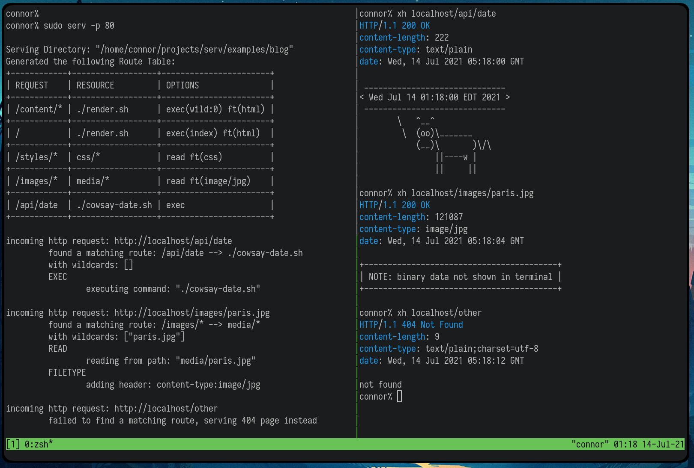

# Serv

Serv is a web server written in Rust. There are a lot of web servers written
in Rust, but this one is mine. It is inspired by static file servers like 
[sfz](https://github.com/weihanglo/sfz),
[serve](https://github.com/vercel/serve), and
[binserve](https://github.com/mufeedvh/binserve),
but with much more flexibility in how routes can be configured.



Serv behaves like a static file server in almost every way, except that when a route needs to do something more
complicated than reading and transmitting a file, it can do so by invoking
another program on the host system. An option called `exec` in the config file
tells the Route to treat the file it points to as an executable and run it,
responding with its output rather than its contents. By doing this, complex
logic can be handled by external programs that are better suited for it, and in
a manner that is more in line with the unix tradition.

This design choice also makes serv language agnostic. APIs can be written in bash,
javascript, python, c, rust, lisp, fortran, or any combination thereof.

Serv is written using the [tide](https://github.com/http-rs/tide) http framework,
and likely inherits most of its strengths and weaknesses. 


## Installation / Usage

You'll need rust installed on your system in order to install serv. It can be 
installed from [here](https://rustup.rs/) and by then running `rustup default nightly`
and `rustup update`.

Most of the examples will have dependencies on external programs. In the case
of the Blog example, you will need `pandoc` installed in order to render 
markdown files, as well as `cowsay` for the date api.

```bash
# install rust and cargo, tell cargo to use the nightly version of the compiler
rustup default nightly
rustup update

# install serv using cargo
cargo install --git https://github.com/connorwiniarczyk/serv.git

# run an example
git clone https://github.com/connorwiniarczyk/serv.git
cd serv/examples/blog

# serv takes a port argument (the default is 4000) and path to a directory.
# If the directory does not contain a valid routes.conf file, a default one
# will be automatically generated
serv -p 4000

# test the server
curl localhost:4000/api/date

# or open it in a browser
```

# Configuration

Each route is defined with a line in a file called `routes.conf`. `routes.conf` is a
whitespace separated values file where the first column represents potential
HTTP requests, the second column represents the corresponding resource on the
host system, and the third column is a list of options that define how the resource will be processed.

## Request Patterns and Resource Patterns

Both the request and resource paths can contain wildcards. ie. `/one/*/two`.
In the request path, this indicates that it will match any request with the
same structure, so `/one/one/two`, `/one/any/two`, etc. but not `/two/any/one`.

In the resource path, wildcards will be filled in by the corresponding
wildcards in the request path. For example, the route
`/styles/*     css/*    read`
will route the request `/styles/main.css` to `css/main.css`.

## Options

Options are how serv derives its flexibility, they are essentially pointers to pre-defined
functions that transform the route's response as it is being generated. They
are called in the order they are written and can be composed arbitrarily. A
list of currently implemented options is included below.

- `read` : Read the resource and append its contents to the body
- `exec(args)` : Execute the resource with the given arguments and append its output to the body
- `header(key:value)` : Add an HTTP header to the response
- `filetype | ft(type)` : Set the MIME type of the response (shorthand for `header(content-type:<type>)`)
- `cors` : Add CORS headers to the response (shorthand for `header(access-control-allow-origin:*)`)

If a Route has no options, it's response will always be empty. At least one
`read` or `exec` option must be included for the route to know how to parse
the resource it is pointing to. For the sake of convenience, if Serv does not
see one of these options in a route while it is being parsed, a `read` option
will be inserted automatically.

### Options with Arguments

Options can take arguments, which can sometimes have values. The syntax for
this is as follows `<option>(<arg1>:<value1> <arg2>:<value2>)`. So for example
all of the following are valid options:

```
exec exec() exec(query) exec(query:key) exec(query:key query:key2)
```


## Example Config

```
# routes.conf example
# <request> <resource> <options>

# Normal Stuff
# The read option is optional, if there is no exec option in the route, it will be inferred
/               index.html              read ft(html)
/css/*          public/styles/*         ft(css)
/js/*           public/scripts/*        ft(js)

# Images/Media
/splash         media/background.jpg    ft(jpg)
/images/*       media/images/*/large    ft(jpg)

# Executables in the PATH are usable as well
/api/date       date                    exec cors ft(text/plain)

/api/register   api/register_user.py    exec(query:username, query:password)
/user/*/info    api/get_user_info.py    exec(wild:0) # using part of the path as an argument

# Rendered Content
/content/*      render_markdown.sh      exec(wild:0)

```

## To Do / Known Issues:

- I would like some kind of `pipe` option that would let me pipe the body of a response into another program. You can get around this by using `exec` on a shell script that does the piping for you, but I think there are instances where it would be cleaner to include all of the logic in the routes file.

- A way for executables to dynamically change the response header and status code. I'm thinking an option that strips the first line from the body and parses that into information about the headers and/or status code

- Better debug information for stuff like explaining whether/why a route is valid or not or when requests fail.

### Ideas for More Options

Just brainstorming

- `log(file)` : write information about the request to a file
- `hook(program, args)` : execute a given 'hook' script. Would be a superset of log, but the distinction might be semantically useful
- `literal` : append the resource to the body as a string
- `status(code)` : change the status code
-  `striplines(range)` : remove a set of lines from the body
